<!-- Generated by GitHub Profile Agent Console. Edit profile.config.json, then run npm run generate. -->

  <picture>
    <source media="(max-width: 760px) and (prefers-color-scheme: dark)" srcset="./assets/hero/agent-console-e4b804b6-mobile-dark.svg">
    <source media="(max-width: 760px)" srcset="./assets/hero/agent-console-e4b804b6-mobile-light.svg">
    <source media="(prefers-color-scheme: dark)" srcset="./assets/hero/agent-console-e4b804b6-dark.svg">
    <source media="(prefers-color-scheme: light)" srcset="./assets/hero/agent-console-e4b804b6-light.svg">
    
  </picture>

  
  

## About Me

I build responsive, scalable web applications end to end, from frontend interfaces to backend services and database design. I pair that with hands-on networking so the products I ship are as reliable on the wire as in the browser.

My work focuses on practical software that solves real problems - clean architecture, thoughtful UX, and infrastructure that is easy to deploy, monitor, and troubleshoot.

## Current Focus

| Area | What I am exploring |
| --- | --- |
| **Fullstack Development** | Responsive web applications built end to end, from UI to API and database. |
| **Network Engineering** | Configuration, optimization, monitoring, and troubleshooting of network infrastructure. |
| **Cloud Deployment** | Shipping and scaling applications on modern platforms with clean CI/CD practice. |

## Featured Work

| Project | Focus | Why it matters |
| --- | --- | --- |
| [**Web Keluarga**](https://github.com/zalfamulki/web-keluarga) | Family website | A family website built with vanilla HTML, CSS, and JavaScript - a shared space where relatives post updates and stay connected. [Live](https://web-keluarga-blush.vercel.app/) |
| [**SmartQueue Mobile**](https://github.com/zalfamulki/Smartqueue_Mobile) | Mobile queue app | A Flutter mobile app that digitizes queue management, reducing wait confusion for customers and staff. |
| [**Kampus Project**](https://github.com/zalfamulki/Kampus-Project) | Academic system | A web-based SIAKAD student academic system that centralizes academic records for a campus. |
| [**Portfolio Website**](https://github.com/zalfamulki/Portofolio-Profile) | Portfolio site | A personal portfolio built with vanilla HTML, CSS, and JavaScript that presents projects and skills in a clean, fast layout. |

## Direction

I enjoy designing complete web solutions - crafting clean interfaces, integrating backend services, optimizing performance, and building reliable network infrastructure that keeps applications fast and available.

## Tech Stack

`HTML` · `CSS` · `JavaScript` · `TypeScript` · `React` · `Next.js` · `Laravel` · `PHP` · `MySQL` · `Python` · `Git` · `Vercel` · `MikroTik`

## Recent Activity

<!-- AUTO:ACTIVITY:START -->
- Jul 31, 2026: pushed 1 commit to [zalfamulki/web-matematika](https://github.com/zalfamulki/web-matematika).
- Jul 31, 2026: created a branch in [zalfamulki/web-matematika](https://github.com/zalfamulki/web-matematika).
- Jul 31, 2026: pushed 1 commit to [zalfamulki/zalfamulki](https://github.com/zalfamulki/zalfamulki).
- Jul 31, 2026: created a branch in [zalfamulki/zalfamulki](https://github.com/zalfamulki/zalfamulki).
- Jul 26, 2026: pushed 1 commit to [zalfamulki/web-keluarga](https://github.com/zalfamulki/web-keluarga).
- Jul 26, 2026: created a branch in [zalfamulki/web-keluarga](https://github.com/zalfamulki/web-keluarga).
<!-- AUTO:ACTIVITY:END -->

---

  Building modern web applications and reliable network solutions.

